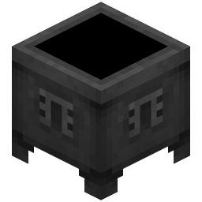

### What's Crucible?

Crucible is a continuation of [Thermos](https://github.com/CyberdyneCC/Thermos) as it has been discontinued.

Advantages over Thermos:
+ It is now possible to build :)

## Build Requirements
* Java 8u101 JDK or higher
* `JAVA_HOME` defined on your OS

## Building
* Checkout project
  * You can use IDE or clone from console:
  `https://github.com/juanmuscaria/Crucible.git`
* Build
  * This process downloads minecraft and apply patches
  * If you have gradle integration in IDE - you can still use gui
  * Manual:
  `./gradlew setupCauldron jar`

All builds will be in `build/distributions`
  
## Updating sources
* Update sources
  * `git pull origin master`
* Re apply patches & build binaries
  * `./gradlew clean setupCauldron jar`

## TODO List:
- [ ] Implement the PaperMC API.
- [ ] Implement the Glowstone API.
- [ ] Rewrite most of Cauldron/Thermos code.
- [ ] Fix most remaining bugs and incompatibilities.
- [ ] Update the Spigot and Bukkit API.
- [ ] Performance Improvements.
- [ ] Rewrite parts of the project build process for easier maintenance.
- [ ] Fixes for better support [Travertine](https://github.com/PaperMC/Travertine).
- [ ] Make the project compatible with Windows.
- [ ] Backport useful things.

[forge]: https://img.shields.io/badge/Minecraft%20Forge-v10.13.4.1614-green.svg "Minecraft Forge v10.13.4.1614"
[mc]: https://img.shields.io/badge/Minecraft-v1.7.10-green.svg "Minecraft 1.7.10"
[java]: https://img.shields.io/badge/Java%20JDK-v1.8-blue.svg "Java JDK 8"
[spigot]: https://img.shields.io/badge/Spigot-v1.7.10--R0.1--SNAPSHOT-lightgrey.svg "Spigot R0.1 Snapshot"